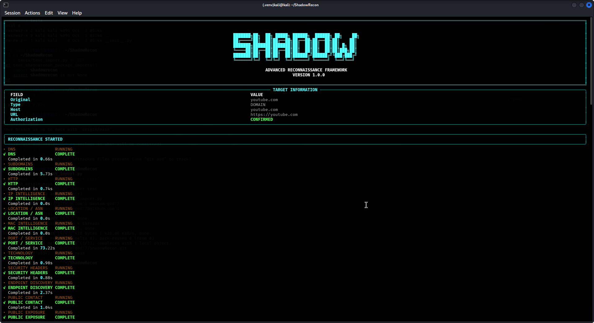

# ShadowRecon

Authorized reconnaissance framework for advance testing.

## Features

- DNS reconnaissance
- Subdomain discovery
- HTTP information
- Public IP intelligence
- Technology detection
- Security header checks
- Endpoint discovery
- Defensive exposure checks
- Terminal-based interface

## Installation

```bash
git clone https://github.com/Gautam-god77/ShadowRecon.git
cd ShadowRecon
chmod +x install.sh
./install.sh
source .venv/bin/activate
shadowrecon

## Screenshot


